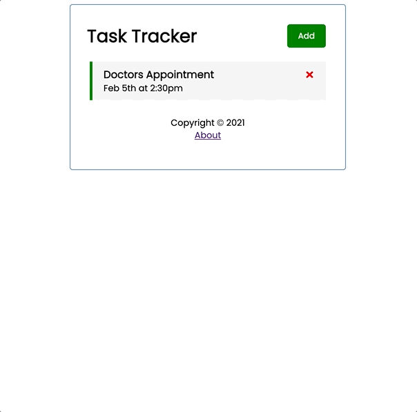

# Task Tracker Demo App

  

This project was bootstrapped with [Create React App](https://github.com/facebook/create-react-app).

I followed along with a [React tutorial](https://www.youtube.com/watch?v=w7ejDZ8SWv8) by Brad Traversy.

## Summary

This app is basically a to-do list app built with React for the sake of practicing functional components and hooks in React.

A user can:

1. view existing tasks
2. add a new task with a title, a day and time, and a reminder
3. double-click a task to change the reminder status
4. click the red x to delete a task
5. view a mostly empty About page and navigate back to the home page
